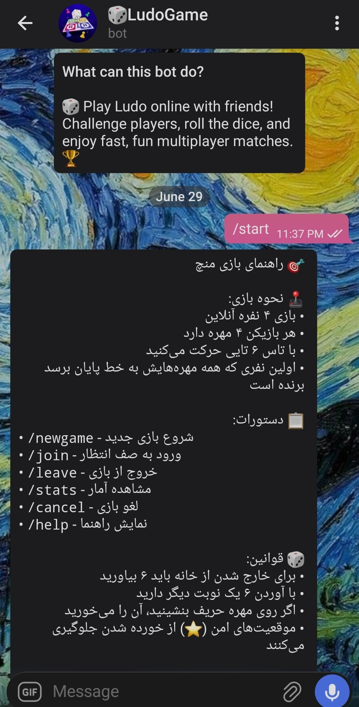

# 🎲 LudoBot - Telegram Ludo Game Bot

## 📸 **Screenshots**

### 🎯 **Bot Preview (Persian Version)**



### 🤖 **Bot Profile Picture**


[](https://www.python.org/)
[](https://core.telegram.org/bots)
[](LICENSE)
[](http://makeapullrequest.com)

> **🌟 A fully-featured Ludo game bot for Telegram with real-time multiplayer, beautiful UI, and chat support!**

---

## 📖 **English**

### 🎯 What is LudoBot?

LudoBot is a complete Telegram bot that brings the classic Ludo board game to your Telegram chats! Play with friends in real-time, chat while playing, and enjoy a beautiful interactive experience - all within Telegram!

### ✨ Features

| Feature | Description |
|---------|-------------|
| 🎲 **Real-time Multiplayer** | Play with 2-4 players online |
| 💬 **In-Game Chat** | Chat with other players while playing |
| 🎨 **Beautiful UI** | Interactive buttons, emojis, and visual board |
| 🔄 **Matchmaking System** | Automatic player matching |
| 📊 **Statistics** | Track your wins, losses, and score |
| 🎭 **Anonymous Mode** | Play without revealing your identity |
| 🏆 **Leaderboard** | Compete for the top spot |
| 🌐 **Multi-language** | English and Persian (Farsi) support |
| 🔒 **Secure** | Database storage with SQLite/PostgreSQL |

### 🚀 Quick Start

#### Prerequisites

- Python 3.11 or higher
- Telegram account
- Internet connection (VPN if Telegram is blocked in your country)

#### Installation

1. **Clone the repository:**
```bash
git clone https://github.com/yourusername/LudoBot.git
cd LudoBot
```

2. **Create and activate virtual environment:**
```bash
# Windows
python -m venv venv
venv\Scripts\activate

# Linux/Mac
python3 -m venv venv
source venv/bin/activate
```

3. **Install dependencies:**
```bash
pip install -r requirements.txt
```

4. **Set up environment variables:**
```bash
# Copy example env file
cp .env.example .env

# Edit .env with your values
# Get BOT_TOKEN from @BotFather on Telegram
# Get OWNER_ID from @userinfobot on Telegram
```

5. **Run the bot:**
```bash
python run.py
```

### 🎮 How to Play

1. **Start the bot:** Send `/start` to your bot
2. **Create or join a game:**
   - Click **"New Game"** to create a game
   - Click **"Join Game"** to join an existing game
3. **Roll the dice:** Click the dice button on your turn
4. **Move tokens:** Select a token to move
5. **Win:** Be the first to get all 4 tokens home!

### 📋 Commands

| Command | Description |
|---------|-------------|
| `/start` | Start the bot and show main menu |
| `/help` | Show help guide |
| `/newgame` | Create a new game |
| `/join` | Join the waiting queue |
| `/leave` | Leave current game or queue |
| `/stats` | View your statistics |
| `/cancel` | Cancel current game |

### 🏗️ Project Structure

```
LudoBot/
├── assets/          # Emojis, messages, board generators
├── bot/             # Bot handlers and main logic
│   ├── handlers/    # Command and callback handlers
│   ├── keyboards/   # Keyboard layouts
│   └── states/      # Game state management
├── config/          # Configuration settings
├── database/        # Database models and manager
├── game/            # Core game logic
│   ├── core/        # Board, dice, player, game engine
│   └── logic/       # Move validation, collision handling
├── services/        # Matchmaking, notification services
├── tests/           # Unit tests
├── utils/           # Helper functions and decorators
├── .env             # Environment variables
├── .env.example     # Example environment file
├── .gitignore       # Git ignore file
├── LICENSE          # MIT License
├── README.md        # This file
├── requirements.txt # Python dependencies
└── run.py           # Entry point
```

### 🔧 Configuration

Edit the `.env` file to configure your bot:

```env
# Required
BOT_TOKEN=your_bot_token_here
OWNER_ID=your_user_id_here

# Optional
DATABASE_URL=sqlite:///ludo.db
REDIS_URL=redis://localhost:6379
SECRET_KEY=your_secret_key
MAX_PLAYERS=4
MIN_PLAYERS=2
TURN_TIMEOUT=60
WAITING_TIMEOUT=120
```

### 🐛 Troubleshooting

#### Connection Issues

If Telegram is blocked in your country, use a VPN or proxy:

1. **Enable VPN** before running the bot
2. **Use a proxy** by setting `API_BASE_URL` in `.env`
3. **Use MTProto Proxy** for better stability

#### Common Errors

| Error | Solution |
|-------|----------|
| `ModuleNotFoundError` | Run `pip install -r requirements.txt` |
| `Timed out` | Check internet connection or use VPN |
| `Invalid token` | Get new token from @BotFather |
| `Database error` | Check DATABASE_URL in .env |

### 🤝 Contributing

We welcome contributions! Here's how you can help:

1. 🐛 **Report bugs** - Open an issue
2. 💡 **Suggest features** - Share your ideas
3. 🔧 **Fix issues** - Submit pull requests
4. 📖 **Improve docs** - Help with documentation
5. 🌍 **Translate** - Add support for more languages

### 👨‍💻 For Developers

This project is perfect for learning:
- **Python** programming
- **Telegram Bot API** development
- **Database** management with SQLAlchemy
- **Async** programming with asyncio
- **Game logic** design

All code is well-commented to help you understand!

### 📝 License

This project is licensed under the MIT License - see the [LICENSE](LICENSE) file for details.

### 🙏 Acknowledgments

- [python-telegram-bot](https://github.com/python-telegram-bot/python-telegram-bot) - Telegram Bot API wrapper
- [SQLAlchemy](https://www.sqlalchemy.org/) - ORM for database
- All contributors and testers!

---

## 📖 **فارسی**

### 🎯 LudoBot چیست؟

LudoBot یک ربات کامل تلگرام است که بازی منچ را به چت‌های تلگرام شما می‌آورد! با دوستان خود به صورت زنده بازی کنید، در حین بازی چت کنید و از یک تجربه تعاملی زیبا لذت ببرید - همه درون تلگرام!

### ✨ ویژگی‌ها

| ویژگی | توضیح |
|-------|-------|
| 🎲 **چندنفره زنده** | بازی با ۲ تا ۴ نفر به صورت آنلاین |
| 💬 **چت درون بازی** | چت با سایر بازیکنان در حین بازی |
| 🎨 **ظاهر زیبا** | دکمه‌های تعاملی، ایموجی‌ها و برد بصری |
| 🔄 **سیستم همسان‌سازی** | تطابق خودکار بازیکنان |
| 📊 **آمار** | پیگیری برد، باخت و امتیاز |
| 🎭 **حالت ناشناس** | بازی بدون افشای هویت |
| 🏆 **جدول امتیازات** | رقابت برای صدر جدول |
| 🌐 **چندزبانه** | پشتیبانی از فارسی و انگلیسی |
| 🔒 **امن** | ذخیره‌سازی با SQLite/PostgreSQL |

### 🚀 شروع سریع

#### پیش‌نیازها

- پایتون ۳.۱۱ یا بالاتر
- حساب تلگرام
- اتصال به اینترنت (در صورت فیلتر بودن تلگرام از وی‌پی‌ان استفاده کنید)

#### نصب

1. **کلون کردن مخزن:**
```bash
git clone https://github.com/yourusername/LudoBot.git
cd LudoBot
```

2. **ساخت و فعال‌سازی محیط مجازی:**
```bash
# ویندوز
python -m venv venv
venv\Scripts\activate

# لینوکس/مک
python3 -m venv venv
source venv/bin/activate
```

3. **نصب وابستگی‌ها:**
```bash
pip install -r requirements.txt
```

4. **تنظیم متغیرهای محیطی:**
```bash
# کپی فایل نمونه
cp .env.example .env

# ویرایش فایل .env با مقادیر خود
# دریافت BOT_TOKEN از @BotFather در تلگرام
# دریافت OWNER_ID از @userinfobot در تلگرام
```

5. **اجرای ربات:**
```bash
python run.py
```

### 🎮 نحوه بازی

1. **شروع ربات:** ارسال `/start` به ربات
2. **ایجاد یا پیوستن به بازی:**
   - کلیک روی **"بازی جدید"** برای ایجاد بازی
   - کلیک روی **"ورود به بازی"** برای پیوستن به بازی موجود
3. **تاس انداختن:** کلیک روی دکمه تاس در نوبت خود
4. **حرکت مهره:** انتخاب مهره برای حرکت
5. **برنده شدن:** اولین نفری باشید که هر ۴ مهره را به خانه می‌رساند!

### 📋 دستورات

| دستور | توضیح |
|-------|-------|
| `/start` | شروع ربات و نمایش منوی اصلی |
| `/help` | نمایش راهنما |
| `/newgame` | ایجاد بازی جدید |
| `/join` | ورود به صف انتظار |
| `/leave` | خروج از بازی یا صف |
| `/stats` | مشاهده آمار |
| `/cancel` | لغو بازی جاری |

### 🏗️ ساختار پروژه

```
LudoBot/
├── assets/          # ایموجی‌ها، پیام‌ها، تولیدکننده‌های برد
├── bot/             # هندلرهای ربات و منطق اصلی
│   ├── handlers/    # هندلرهای دستورات و کل‌بک
│   ├── keyboards/   # چیدمان کیبوردها
│   └── states/      # مدیریت وضعیت بازی
├── config/          # تنظیمات
├── database/        # مدل‌ها و مدیریت دیتابیس
├── game/            # منطق اصلی بازی
│   ├── core/        # برد، تاس، بازیکن، موتور بازی
│   └── logic/       # اعتبارسنجی حرکت، مدیریت برخورد
├── services/        # خدمات همسان‌سازی و اعلان
├── tests/           # تست‌های واحد
├── utils/           # توابع کمکی و دکوریتورها
├── .env             # متغیرهای محیطی
├── .env.example     # فایل نمونه متغیرهای محیطی
├── .gitignore       # فایل نادیده‌گیری گیت
├── LICENSE          # مجوز MIT
├── README.md        # همین فایل
├── requirements.txt # وابستگی‌های پایتون
└── run.py           # نقطه ورود
```

### 🔧 تنظیمات

فایل `.env` را برای تنظیم ربات ویرایش کنید:

```env
# ضروری
BOT_TOKEN=توکن_ربات_اینجا
OWNER_ID=آیدی_شما_اینجا

# اختیاری
DATABASE_URL=sqlite:///ludo.db
REDIS_URL=redis://localhost:6379
SECRET_KEY=کلید_مخفی
MAX_PLAYERS=4
MIN_PLAYERS=2
TURN_TIMEOUT=60
WAITING_TIMEOUT=120
```

### 🐛 عیب‌یابی

#### مشکلات اتصال

اگر تلگرام در کشور شما فیلتر است، از وی‌پی‌ان یا پروکسی استفاده کنید:

1. **روشن کردن وی‌پی‌ان** قبل از اجرای ربات
2. **استفاده از پروکسی** با تنظیم `API_BASE_URL` در `.env`
3. **استفاده از MTProto Proxy** برای پایداری بیشتر

#### خطاهای رایج

| خطا | راه‌حل |
|-----|-------|
| `ModuleNotFoundError` | اجرای `pip install -r requirements.txt` |
| `Timed out` | بررسی اتصال اینترنت یا استفاده از وی‌پی‌ان |
| `Invalid token` | دریافت توکن جدید از @BotFather |
| `Database error` | بررسی DATABASE_URL در .env |

### 🤝 مشارکت

ما از مشارکت شما استقبال می‌کنیم! راه‌های کمک:

1. 🐛 **گزارش باگ** - ایجاد issue
2. 💡 **پیشنهاد ویژگی** - اشتراک ایده‌ها
3. 🔧 **رفع مشکلات** - ارسال pull request
4. 📖 **بهبود مستندات** - کمک به مستندات
5. 🌍 **ترجمه** - افزودن پشتیبانی زبان‌های بیشتر

### 👨‍💻 برای توسعه‌دهندگان

این پروژه برای یادگیری عالی است:
- برنامه‌نویسی **پایتون**
- توسعه **ربات تلگرام**
- مدیریت **دیتابیس** با SQLAlchemy
- برنامه‌نویسی **ناهمزمان** با asyncio
- طراحی **منطق بازی**

تمام کدها کامنت‌گذاری شده تا به شما در درک کمک کند!

### 📝 مجوز

این پروژه تحت مجوز MIT است - برای جزئیات به فایل [LICENSE](LICENSE) مراجعه کنید.

### 🙏 قدردانی

- [python-telegram-bot](https://github.com/python-telegram-bot/python-telegram-bot) - کتابخانه ربات تلگرام
- [SQLAlchemy](https://www.sqlalchemy.org/) - ORM برای دیتابیس
- همه مشارکت‌کنندگان و تست‌کنندگان!

---

## 🌟 Support / پشتیبانی

- **English:** Open an issue on GitHub
- **فارسی:** در گیت‌هاب issue باز کنید

---

## 📊 Project Stats


---

## 🎯 Roadmap

- [ ] Voice chat support
- [ ] Tournament mode
- [ ] Custom themes
- [ ] Friends list
- [ ] Push notifications
- [ ] More game modes
- [ ] Mobile app integration

---

**⭐ Star this repository if you like it!**

**🤝 Contributions are always welcome!**

**🎲 Have fun playing Ludo!**